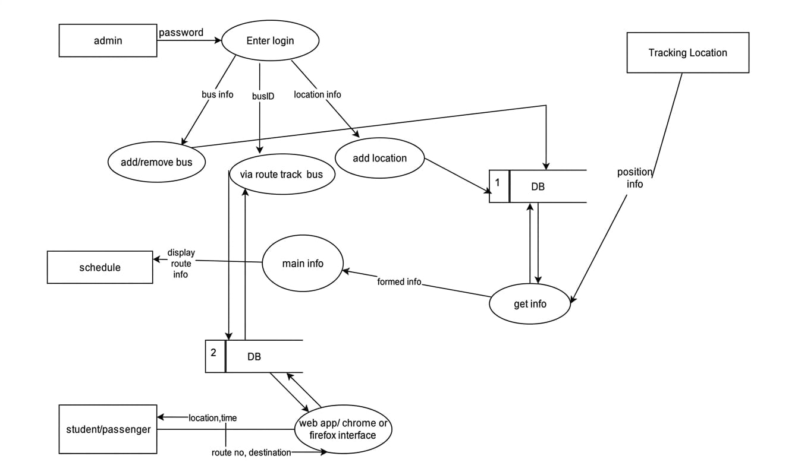
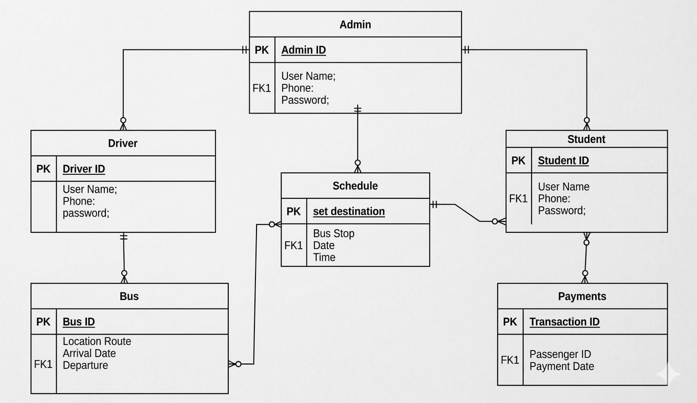

# BusConnect: IoT Integrated Bus Tracking And Alarming Location System

[](https://flutter.dev/)
[](https://nodejs.org/)
[](https://firebase.google.com/)
[]()
[](https://opensource.org/licenses/MIT)

> An intelligent transit logistics system featuring real-time GPS tracking and geofence-triggered proximity alarms. A full-stack, distributed public transit ecosystem engineered to optimize long-distance travel. By bridging physical vehicle telemetry with a cross-platform mobile application, this system introduces real-time tracking, a dynamic bid-based pricing marketplace, and predictive routing optimizations.

## Table of Contents
- [Core Technical Innovations](#-core-technical-innovations)
- [System Architecture](#-system-architecture)
- [Feature Matrix](#-feature-matrix)
- [Technology Stack](#-technology-stack)
- [Risk Mitigation & Reliability (PI Matrix)](#-risk-mitigation--reliability)
- [Local Setup & Deployment](#-local-setup--deployment)
- [Future Scope](#-future-scope)

---

## Core Technical Innovations

Unlike standard point-to-point transit applications (e.g., Uber, Pathao), BTALS incorporates advanced systems engineering and database optimization techniques tailored for mass transit:

* **Directional Database Optimization:** Engineered a specialized database schema that attaches directional context (inbound vs. outbound) to route data. This approach **reduced database storage requirements by 50%**, preventing server exhaustion and eliminating redundant coordinate logging.
* **Predictive Velocity via Clustering:** Implements a clustering methodology to analyze and predict the average velocity of buses. This allows the system to dynamically adjust Estimated Times of Arrival (ETAs) based on historical traffic conditions and the specific time of day.
* **High-Frequency Telemetry Integration:** Hardware NEO-6M GPS receivers and onboard GSM modems push live coordinate payloads to the centralized backend with a strict **2-second polling interval**, ensuring highly accurate, low-latency mapping.
* **Bid-Based Economic Engine:** A custom marketplace algorithm allowing passengers to broadcast long-distance ride requests with custom budgets. Drivers within the geo-fenced region can review and submit competitive bids, ensuring fair market pricing and efficient resource allocation.

---

## System Architecture

The ecosystem relies on a highly scalable, decoupled architecture to handle concurrent mobile users and continuous IoT data streams.

### Data Flow & Entity Relationships
*(Note: Replace placeholder images with your actual DFD and ER diagrams)*


> **Figure 1:** Level 1 DFD illustrating the asynchronous flow of GPS coordinates from hardware nodes to the Firebase Realtime Database, and the subsequent push notifications to client devices.


> **Figure 2:** Core database schema highlighting the 1:M and M:M relationships between Administrative nodes, Fleet Vehicles, Drivers, and Passenger Payment ledgers.

---

## Feature Matrix

The platform utilizes Firebase Authentication to securely manage distinct operational roles and access control:

### Passenger Client
* **Live Telemetry Tracking:** View assigned buses on an interactive map updated every 2 seconds.
* **Bid-Marketplace:** Submit detailed ride requests (date, destination, budget) and review incoming driver bids.
* **Geo-Fenced Alarms:** Proximity-based algorithms trigger automated push notifications when the bus approaches the user's defined drop-off coordinate.

### Driver Client
* **Fleet Integration:** Register vehicle specifics (Bus Model, Color, Capacity).
* **Dynamic Bidding:** Review regional passenger requests and submit competitive pricing bids.
* **Trip Lifecycle Management:** State management for trip initialization, live routing, arrival confirmation, and digital/cash fare collection.

### Admin Dashboard
* **Fleet Oversight:** Global view of all active network nodes (buses).
* **Route Deviation Alerts:** Automated flagging if a driver deviates from the algorithmically assigned schedule or route.

---

## Technology Stack

| Domain | Technology / Framework | Function |
| :--- | :--- | :--- |
| **Mobile Frontend** | Flutter, Dart | Cross-platform UI/UX for iOS & Android |
| **Backend API** | Node.js, Express.js | Server-side logic and request routing |
| **Database** | Firebase Realtime DB | Low-latency state synchronization |
| **Auth & Cloud** | Firebase Auth, Cloud Functions | Secure access control & serverless execution |
| **Hardware Node** | NEO-6M GPS, GSM Modem | Physical telemetry tracking & transmission |
| **Mapping** | Google Maps SDK | Geospatial rendering and distance matrix |

---

## Risk Mitigation & Reliability (PI Matrix)

Enterprise reliability was a primary focus during the architecture phase. A qualitative Probability and Impact (PI) Risk Analysis was executed to harden the system against real-world failures:

1. **Server Downtime Mitigation (High Risk - Score: 0.35):** Counteracted by migrating from standard PostgreSQL to Firebase's globally distributed, highly available cloud infrastructure.
2. **Data Loss Prevention (High Risk - Score: 0.49):** Addressed via continuous Realtime Database state syncing and automated backup intervals.
3. **Location Drifting (Hardware Error):** Minimized by establishing a firmware-level requirement of a minimum 4-satellite connection threshold before the GPS module pushes coordinates to the backend.

---

## Local Setup & Deployment

### Prerequisites
* Flutter SDK (>= 3.0.0)
* Node.js (v16.x or higher)
* Firebase CLI installed globally (`npm install -g firebase-tools`)

### Installation Steps

1. **Clone the repository:**
   ```bash
   git clone [https://github.com/tankim-prio/Bus-Tracking-And-Alarming-Location-System.git](https://github.com/tankim-prio/Bus-Tracking-And-Alarming-Location-System.git)
   cd Bus-Tracking-And-Alarming-Location-System
